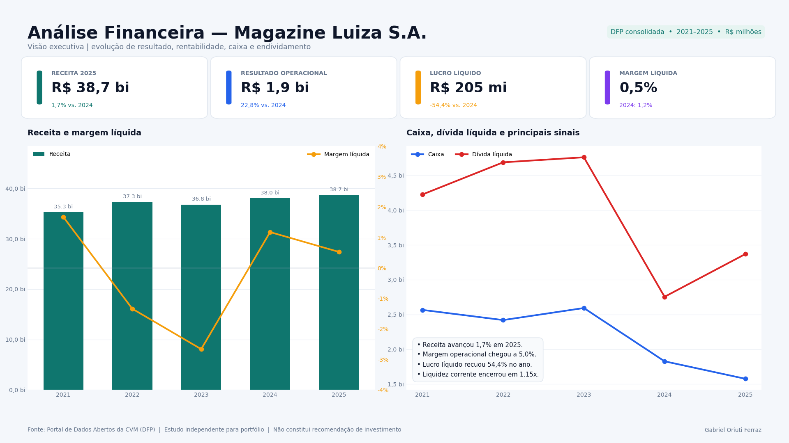
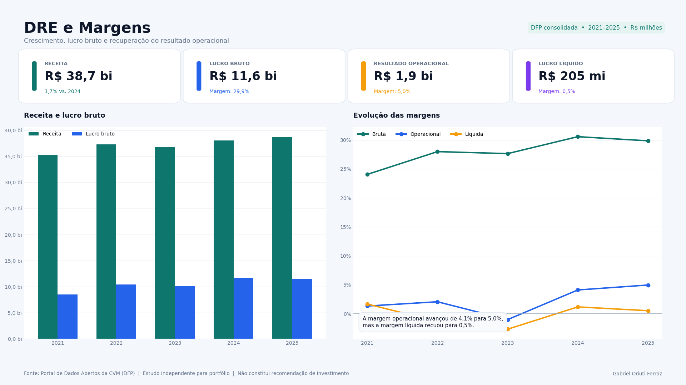
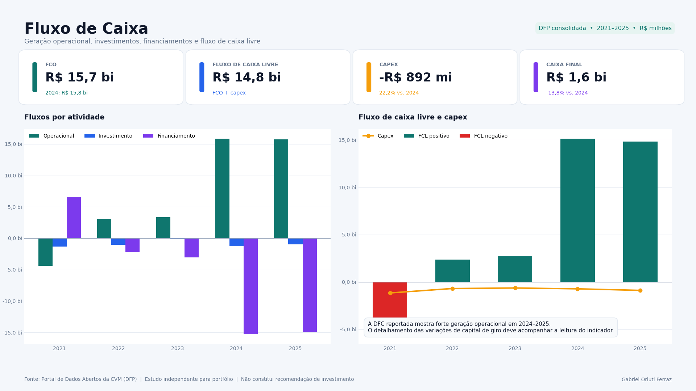
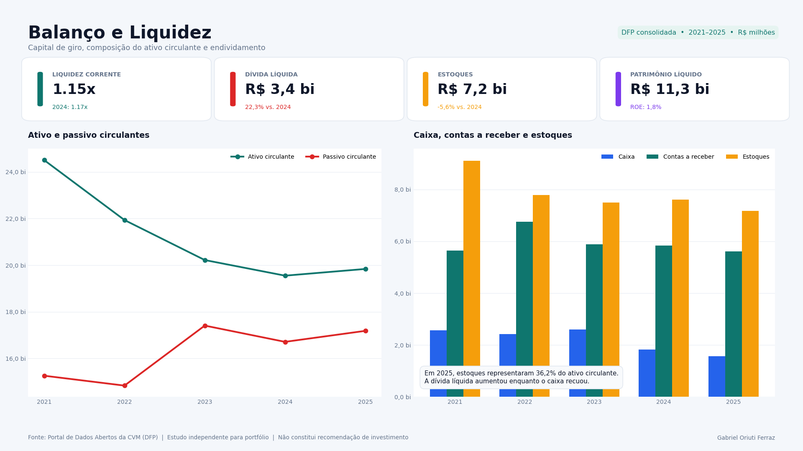
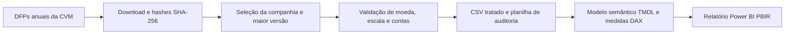

# Dashboard Financeiro — Magazine Luiza S.A.


Projeto de Business Intelligence que transforma demonstrações financeiras públicas da Magazine Luiza S.A. em uma análise executiva de resultado, margens, fluxo de caixa, liquidez e endividamento.

O repositório foi construído como um estudo completo de portfólio: aquisição e tratamento dos dados, regras de qualidade, modelo semântico em TMDL, medidas DAX, relatório Power BI em PBIP/PBIR, planilha de auditoria e documentação da metodologia.

> **Aviso:** estudo independente, educacional e de portfólio. Não possui vínculo com a Magazine Luiza ou com a CVM e não constitui recomendação de investimento.

## Visão executiva



## Perguntas respondidas

- Como receita, lucro e margens evoluíram entre 2021 e 2025?
- A melhora operacional chegou ao lucro líquido?
- Como se comportaram a geração de caixa, o capex e o caixa final?
- O capital de giro e a liquidez ficaram mais ou menos pressionados?
- Como caixa e dívida líquida se relacionaram ao longo do período?

## Principais leituras de 2025

- Receita de **R$ 38,7 bilhões**, crescimento de **1,7%** sobre 2024.
- Resultado operacional de **R$ 1,9 bilhão**, avanço de **22,8%** no ano.
- Margem operacional de **5,0%**, contra **4,1%** em 2024.
- Lucro líquido de **R$ 204,6 milhões**, queda de **54,4%**; margem líquida de **0,5%**.
- Liquidez corrente de **1,15x** e dívida líquida de **R$ 3,4 bilhões**.
- FCO reportado de **R$ 15,7 bilhões**. A leitura deve ser acompanhada do detalhamento das variações de capital de giro na DFC.

## Páginas do relatório

| Visão Executiva | DRE e Margens |
|---|---|
|  |  |

| Fluxo de Caixa | Balanço e Liquidez |
|---|---|
|  |  |

As imagens são prévias visuais geradas com a mesma base tratada do modelo. O projeto Power BI contém as quatro páginas correspondentes em formato PBIP/PBIR.

## Pipeline



## Dados e metodologia

- **Fonte:** [Portal de Dados Abertos da CVM — DFP](https://dados.cvm.gov.br/dataset/cia_aberta-doc-dfp).
- **Companhia:** Magazine Luiza S.A. — CNPJ `47.960.950/0001-21`.
- **Período:** 2021 a 2025.
- **Escopo:** demonstrações consolidadas.
- **Versão:** maior `VERSAO` disponível para cada ano.
- **Exercício:** `ORDEM_EXERC = ÚLTIMO`.
- **Escala:** valores originais em R$ mil, convertidos para R$ milhões no modelo.
- **Demonstrações:** DRE, BPA, BPP e DFC pelo método indireto.

Os dados brutos não são republicados no repositório. Os scripts baixam os ZIPs diretamente da CVM e registram o hash SHA-256 de cada arquivo. A camada processada, pequena e auditável, é disponibilizada em `data/processed/`.

Veja os detalhes em [Metodologia](docs/metodologia.md) e no [dicionário de métricas](data/processed/dicionario_metricas.csv).

## Modelo Power BI

O pacote completo para abrir no Power BI Desktop é:

[`powerbi/Dashboard Financeiro Magazine Luiza - PBIP.zip`](powerbi/Dashboard%20Financeiro%20Magazine%20Luiza%20-%20PBIP.zip)

Extraia o ZIP e abra `Dashboard Financeiro Magazine Luiza.pbip`.

O projeto inclui:

- modelo semântico versionável em **TMDL**;
- dados anuais incorporados por **Power Query M**, sem dependência de caminho local;
- **37 medidas DAX**, incluindo KPIs do último exercício, margens, liquidez, ROE e crescimento;
- relatório em **PBIR** com quatro páginas e 12 visuais;
- tema neutro, sem uso da identidade visual ou do logotipo da companhia;
- validação do PBIR com a ferramenta oficial da Microsoft: **0 erros e 0 avisos**.

Use uma versão atual do Power BI Desktop com suporte a PBIP/PBIR e siga o [guia de abertura](powerbi/README.md).

## Planilha de auditoria

O arquivo [`data/analise-financeira-magazine-luiza.xlsx`](data/analise-financeira-magazine-luiza.xlsx) oferece uma segunda forma de revisar o projeto. Ele contém:

- dashboard executivo;
- dados reportados e indicadores calculados por fórmula;
- reconciliação entre ativo e passivo;
- testes de duplicidade, completude, escala e período;
- dicionário de métricas;
- URLs, versões e hashes dos arquivos da CVM.

## Como reproduzir

```bash
python -m venv .venv

# Windows
.venv\Scripts\activate

pip install -r requirements.txt
python scripts/download_dados_cvm.py
python scripts/preparar_dados.py
python scripts/gerar_pbip.py
python scripts/empacotar_pbip.py
python scripts/gerar_imagens_dashboard.py
```

Depois, abra o arquivo `.pbip` no Power BI Desktop.

## Estrutura do repositório

```text
├── data/
│   ├── processed/                 # CSVs tratados, dicionário e metadados
│   └── analise-financeira-...xlsx # planilha de auditoria
├── docs/
│   ├── images/                    # prévias das quatro páginas
│   ├── metodologia.md
│   └── revisao-qualidade.md
├── powerbi/
│   ├── Dashboard ... - PBIP.zip   # projeto completo para extração
│   └── README.md                  # instruções de abertura
├── scripts/
│   ├── download_dados_cvm.py
│   ├── preparar_dados.py
│   ├── gerar_pbip.py
│   ├── empacotar_pbip.py
│   ├── gerar_imagens_dashboard.py
│   └── validar_projeto.py
├── DATA_LICENSE.md
├── LICENSE
└── THIRD_PARTY_NOTICES.md
```

## Qualidade e limitações

As duas revisões finais estão documentadas em [Revisão de qualidade](docs/revisao-qualidade.md). Entre os controles executados estão: chave única `Ano + Métrica`, ausência de valores nulos nas contas selecionadas, reconciliação exata do balanço, conferência dos códigos contábeis e validação estrutural do PBIR.

A interpretação é uma análise do autor e deve ser lida junto das demonstrações completas, notas explicativas e fatos relevantes divulgados pela companhia.

## Licenças

- Código e documentação: [MIT](LICENSE).
- Dados e derivados da CVM: [ODbL 1.0](DATA_LICENSE.md), sujeitos também aos [termos de uso do portal](https://dados.cvm.gov.br/about).
- Componentes de terceiros: [THIRD_PARTY_NOTICES.md](THIRD_PARTY_NOTICES.md).

## Autor

**Gabriel Oriuti Ferraz**<br>
[LinkedIn](https://www.linkedin.com/in/gabriel-oriuti/) · [GitHub](https://github.com/oriuti) · [E-mail](mailto:gabriel.oriuti@live.com)
